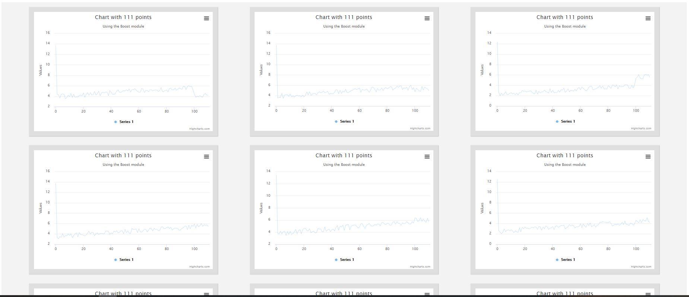

# Web Workers with highchart
## A simple demo of spawning a new web worker with each highchart. 
  - Web workers are used to process the data asynchronously for each chart. After processing, same is sent back to the highcrat to be rendered. Also once rendered, it's terminated.

To Run the examples, I serve them with http-server.

 ## Install dependencies.
```bash
npm install
```
## Run the code server as:
```
npm start
```
## Configuration UI
<p align="center">
  
</p>

## Charts 
<p align="center">
  
</p>
